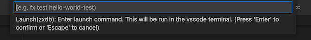

# zxdb for VS Code

[The VS Code zxdb extension](https://marketplace.visualstudio.com/items?itemName=fuchsia-authors.zxdb)
provides IDE based [zxdb](https://fuchsia.dev/fuchsia-src/development/debugger?hl=en) debugger
support for developers working with the open source [Fuchsia](https://fuchsia.dev/) operating system.

## Features

- One click debugging - Press **F5** to start debugging on Fuchsia devices.
- Launch or Attach to a process from VS Code.
- zxdb console is parallely accessible in the integrated terminal.
- Works with VS Code Remote.
- Breakpoints, Exceptions, Stacktraces, Local Variables, Registers, Debug Hover
- Pause/Resume, Step In/Step Out/Step Over, Restart

## Prerequisites

1. If you don’t have the fuchsia source tree, see the
   [Fuchsia setup guide](https://fuchsia.dev/fuchsia-src/get-started/get_fuchsia_source?hl=en).
1. If this is the first time using zxdb, see the
   [zxdb setup guide](https://fuchsia.dev/fuchsia-src/development/debugger/running?hl=en).
1. If this is the first time using VS Code, see
   [VS Code setup for Fuchsia](https://fuchsia.dev/fuchsia-src/development/editors/vscode?hl=en).

## Quick start

- **Step 1:** Make sure that the target device is running fuchsia and the package server
  (like `fx serve`) has started on the development host. Make sure to have installed the
  [zxdb](https://marketplace.visualstudio.com/items?itemName=fuchsia-authors.zxdb)
  extension from VS Code marketplace.

- **Step 2:** Open VS Code application. Open the Fuchsia source directory (Click **File** then
  **Open..** or **Open Folder..** then select the Fuchsia directory).

- **Step 3:** Open the source code of the program you want to debug and add breakpoints by clicking
  on the editor margin or using **F9** on the current line.

  

- **Step 4:** Add a launch configuration (Click **Run** then **Add Configuration**, if there is a
  drop down select zxdb). Update fields marked as _TODO_ in the launch.json. You only need to
  do this step whenever you want to update the configuration. See [this](#launch-configuration)
  section for more launch options.

  

- **Step 5:** Start debugging (press **F5** or **Play** button). See this
  [guide](https://code.visualstudio.com/docs/editor/debugging) to learn about VS Code debugger.

See [troubleshooting guide](https://github.com/google/vscode-zxdb/blob/main/TROUBLESHOOTING.md)
if you face any issues.

## Launch Configuration

VS Code keeps debugging configuration information in a `launch.json` file located in a .vscode
folder in your workspace (project root folder) or in your
[user settings](https://code.visualstudio.com/docs/editor/debugging#_global-launch-configuration) or
[workspace settings](https://code.visualstudio.com/docs/editor/multi-root-workspaces#_workspace-launch-configurations).
In Step 4 of [Quick Start](#quick-start), this file is created automatically if it doesn’t
already exist.

You can add as many launch configurations as you need and pick one before starting to debug.

Follow these steps to update your launch configuration:

1. Click **Run** then **Open Configuration** to open launch configuration.
1. To add new configurations, Click **Run** then **Add Configuration** and scroll down to zxdb
   configuration snippets (_Hint: type zxdb to get there faster_).

   

1. Pick a configuration that matches your workflow.

   1. **Launch** configurations: Use this if you want to use VS Code to both launch and
      debug the program.

      Required fields:

      - Launch command: Shell command to launch the program.

        Example launch commands: fx test -o hello-world-test, fx shell i2cutil, fx run hello-world

      - Process name: Name of the process that will be started by the launch command.

        Example process name: hello-world-test, hello-world (partial names are also valid)

   1. **Attach** configurations: Use this if you want to use VS Code only for debugging.
      You need to launch the program manually.

      Required fields:

      - Process name: Name of the process to debug.

   An example launch configuration file can be found [here](https://github.com/google/vscode-zxdb/blob/main/example-launch.json)

1. Save the `launch.json`. The configuration names would appear in the launch configuration dropdown.

   

1. Select the required configuration from the dropdown and start debugging.

> **Tip**: Launch configuration can be quickly accessed by clicking on the gear button as shown below -
>
> 

> **Note**: _Launch(zxdb) Input box_ / _Attach(zxdb) Input box_ configurations allow you to enter the
> customizable fields into a pop-up input box during every run just before the debugger starts.
> Use this as a generic configuration. However, inputs will not be saved and need to be entered in
> every run, which could be a compelling reason to update `launch.json` manually as described above.
>
> 

## Extension configuration

To configure the extension, open settings (`Ctrl/Cmd + Shift + P` and type
**Preferences: Open Settings(UI)**). Type zxdb in the search bar to view and update the zxdb
extension configurations. After changing any of these configurations reload the VS Code window
(`Ctrl/Cmd + Shift + P` and type **Reload Window**) for it to take effect.

## Report issues

Please report issues/feedback
[here](https://bugs.fuchsia.dev/p/fuchsia/issues/entry?components=Tools%3Ezxdb;cc=puneetha@google.com;).

Please collect logs by following these steps to append to the report:

- For verbose logs, set `zxdb.debug: true` as described in the [this](#extension-configuration)
  section.
- Go to the output panel (Click **View** then **Output**)
- From the dropdown in the top right of that panel select zxdb.
- Copy all the logs (Click anywhere in the output panel, then press `Ctrl/Cmd + A` followed by
  `Ctrl/Cmd + C`). Paste the logs to a text file and attach it to the bug report.

## Release Notes

See the [CHANGELOG](https://github.com/google/vscode-zxdb/blob/main/CHANGELOG.md)
