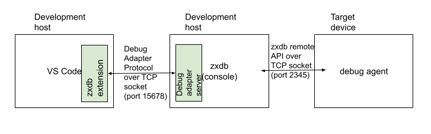
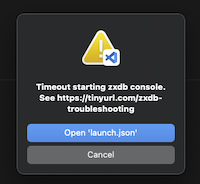
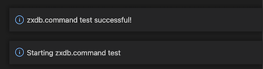
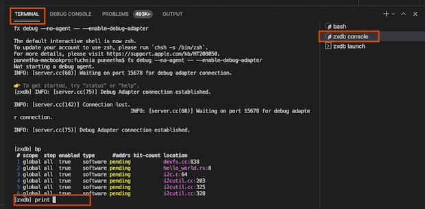

# zxdb for VS Code: Troubleshooting Guide

### 1. Help me understand how this extension works.

In a nutshell, the extension communicates with the zxdb console program using VS Code
[Debug Adapter protocol](https://microsoft.github.io/debug-adapter-protocol/) on port 15678.
When you launch the zxdb debug extension in VS Code, it opens a new VS Code terminal to launch
the zxdb console by using `zxdb.command` settings (such as `fx debug`). The zxdb console is in turn
connected to a debug agent started on the target device. Once the zxdb console starts, if needed it
launches the debuggee program in another VS Code terminal by using the launchCommand configuration
(such as `fx test hello-world`). The extension connects VS Code debugger UI and the zxdb console by
forwarding debug configurations, events, exceptions, stacktraces, and process status.



### 2. I do not use fx in my development workflow. Can I still use this extension?

**Yes**. The extension is configured by default to use `fx debug`. This can be changed by
configuring `zxdb.command` settings as explained in [this](#6-how-to-change-zxdbcommand) section.
There are no other dependencies on `fx`.

### 3. fx and/or zxdb does not work in the VS Code terminal.

VS Code shell might have to be configured - See
[VS Code shell config](https://code.visualstudio.com/docs/editor/integrated-terminal) and
[shell config for fx](https://fuchsia.dev/fuchsia-src/get-started/get_fuchsia_source?hl=en#set-up-environment-variables).

### 4. **"Timeout starting zxdb console"** error.



This error occurs when the VS Code debugger is trying to connect to the zxdb console and fails.
When the **Run** is clicked, VS Code launches a terminal `zxdb console` and tries to start
the zxdb console. The zxdb console listens on the 15678 port for incoming debug adapter
connections. If the VS Code debugger is unable to connect to it within 30 seconds,
it throws this error.

Try these steps to resolve the issue:

- Make sure that the device is up and the package server (like `fx serve) is running.
- Ensure `zxdb.command` is set correctly as described [here](#5-how-to-test-zxdbcommand).
- Increase the timeout if `zxdb.command` is correct, but it takes longer to connect with VS Code.
  See [extension configuration](https://github.com/google/vscode-zxdb/blob/main/README.md#extension-configuration)
  for steps.

### 5. How to test `zxdb.command`

Follow these steps to ensure that zxdb launches in VS Code without any errors.

- Open VS Code Command palette(`Ctrl/Cmd + Shift + P`)
- Enter “zxdb: Run zxdb.command”
- You should observe these notifications which indicate that there was no issue launching
  zxdb console.

  

- If you receive an error message, you might have to change the `zxdb.command` as
  explained in [this](#6-how-to-change-zxdbcommand) section.

### 6. How to change `zxdb.command`

`zxdb.command` is an extension setting and can be changed as mentioned in
[this](https://github.com/google/vscode-zxdb/blob/main/README.md#extension-configuration) section.

`zxdb.command` can be set to any of the following -

1.  By default it is set to `fx debug -- --enable-debug-adapter`.
1.  If you are not using fx, you will have to replace it with a shell script containing
    commands to launch zxdb and debug_agent.

    For example, run this in a shell:

    ```
    cat <<EOT > launch_zxdb.sh
    [ -z "\$DEVICE_IP" ] && echo "DEVICE_IP not set" && exit 1
    echo "Starting debug agent"
    fssh run fuchsia-pkg://fuchsia.com/debug_agent#meta/debug_agent.cmx --port=2345
    echo "Starting zxdb console"
    zxdb --enable-debug-agent --connect $DEVICE_IP:2345
    EOT
    ```

    And set `zxdb.command` = “./launch_zxdb.sh”

1.  If you want to start the zxdb console in an external terminal, set zxdb.console to an empty
    string (""). Make sure to include the `--enable-debug-adapter` flag when starting zxdb.
    VS Code debugger will be able to connect to it.

After changing `zxdb.command`, be sure to test it out as described [here](#5-how-to-test-zxdbcommand).

### 7. How to use the zxdb console along with the extension?

Some features of the zxdb console are missing in the UI. Example, inspecting memory with
`x` or `as` command, disassembly, stepping into assembly code. Since the zxdb console is also
launched by VS Code during debugging, it has all the context of the ongoing VS Code debug session
and can be used for more advanced debugging.

To start using zxdb console commands, switch to the zxdb console terminal as shown below.



## Known issues:

- [Bug 80120](https://fxbug.dev/80120): Occasionally, Breakpoint hits are not visible in UI

  Workaround: Go to the zxdb console view as shown above and continue debugging.
  The problem goes away if you stop and start debugging again.
